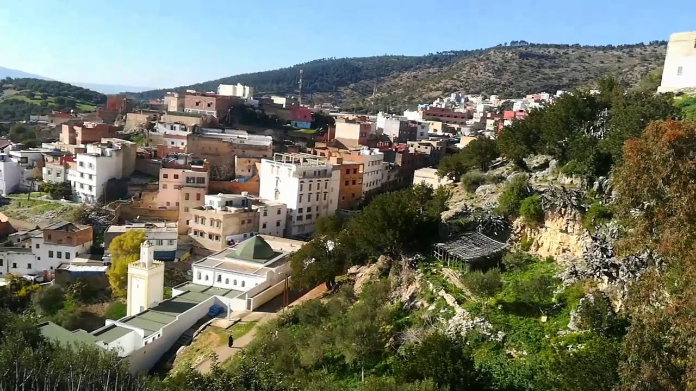

+++
author = "Meryem Ben yahia"
title = "Sidi Ali ben Hemdouch: Social and Religious Dynamics in Morocco"
date = "2019-06-21"
description = "A reflection on Dr. Khalid Mouna's “Le corps à l'épreuve du sacré: le rituel du corps à Sidi Ali Ben Hamdouch au Maroc”"
categories = [
    "Morocco",  "Anthropology", 
]
tags = [
    "Sorcery",
    "Superstitution",
    "Psychology",
    "Religion",
    "LGBTQ+"
]

image = "sidiali1.jpg"
+++

## Who is Khalid Mouna?

Dr. Khalid Mouna is an anthropologist, professor of sociology at Moulay Ismail University in Meknes. His research publications focus on cannabis, social mobilization and migration. Dr. Mouna’s article, “Le corps à l'épreuve du "sacré": le rituel du corps à Sidi Ali Ben Hamdouch au Maroc”, delves into the fundamental relationship between social and religious dynamics in Morocco. He studied Sidi Ali ben Hemdouch as a social laboratory to study the construction of sainthood, sacred spaces and the therapeutic power of “L’baraka” or spiritual blessings. His research was for the most-part observational and exploratory, with the exception of twenty semi-structured interviews aimed at unifying diverse myths surrounding the role and sainthood of Lalla Aicha; as the orality surrounding her reflects the inversion of gender roles, L’baraka and chains of power. In this post, I reflect on some of the ideas in his article.

## The Scene of Sidi Ali Ben Hemdouch

 

Sidi Ali Ben Hamdouch is a small town in the semi-mountainous region on the heights of Zerhoun, near Meknes.
After each Mawlid commemoration, the locals erect a sanctuary that bubbles the day with Sufi vigils, chanting, sacrifices of chicken, sheep and cows and other folk songs performed by the “H’madcha” troops, guardians of the temple. The town lits up during the seven days of the Moussem, arrived from different localities, some from abroad, the pilgrims occupy night and day the mausoleum of the “Saint”, begging for his legendary blessing. 
They light candles on a wall blackened with burns, sprinkle it with rose water, and bring baskets of dwarf palms filled with milk, henna, incense and bread. A whole procession improvised by these pilgrims who, powdering their faces white, introduce their offerings (H’diya) reminiscent of the traditional wedding ceremonies.
![Sacrifice of sheep during the Sidi Ali festival, January 21, 2014 in Sidi Ali, near Meknes, Morocco [Fedel Senna / AFP]](sidiali.png)
Dr. Mouna considers Sidi Ali as proof of a broken barrier between a popular Islam and an official scholarly Islam in Morocco. Through his argumentation, he successfully evokes and contextualizes the myths of Lalla Aicha Al Hmdouchia, Sidi Ali and Sidi Ahmed socially by establishing a link between spiritual healing rituals and Moroccan lore; as he defines myths as subscribing to a partial reality involved in social, cultural and religious dynamics transmitted from generation to generation, and most importantly as a way of legitimizing power. 

### The origins

According to some of Dr. Mouna’s sources, Sidi Ali first arrived in the village of Beni Rached as a lost traveler, where he founded a Zawya and then proceeded to birth himself as a saint by performing a miracle; the one of life. He had helped the young wife of the Sultan Moulay Ismail conceive after much difficulty, and the Sultan after learning of his miracle had honored Sidi Ali by the construction of mausoleum to establish him as a saint to be revered. Another myth places Sidi Ali as the mqaddem of the Sultan and as one capable of cursing others into blindness and sickness for mystical ends. 

The other important figure, Sidi Ahmed Dghoughi wanted to be a servant and disciple of Sidi Ali and was promised the same Baraka if he prepared him water of his ablutions and brought him back the wife of his choosing: a princess of Sudan; Aisha the daughter of King Ol Khir. Sidi Ahmed took on the quest and travelled to Sudan to bring the bride, only to be find out at his return the unfortunate news of his master’s demise. Sidi Ahmed could not bear the news; he broke down and stabled the beginning of what would be known as the Hmdouchi rite: he hacked his head with an ax and hayed Allah. Aicha disappears with the news of the death of Sidi Ali. 
During the talk in the class, Dr. Mouna evocated a myth which placed Lalla Aicha as dotted with the power of shapeshifting into the opposite sex. In this context, without the protection of either Sidi Ali and Sidi Ahmed, she becomes vulnerable to the most wicked intent of the villagers. To escape getting violated by a horde of men, she shapeshifts into a man, but to her dismay she still is violated. 
Angered and aggravated, Aicha goes on to become this vengeful spirit against men. 

However, stories surrounding the three figures imply sexual inversion. The sexual proximity between Sidi Ahmed and Sidi Ali is heavily implied; such as that Sidi Ali is considered as the patron of homosexual men, or as stated in the article the patron of the derogatory term ‘zwamal’, and Aicha as this spiritual figure working hand in hand with the saint to protect the patronized. The apparition of Lalla Aicha as a spiritual figure decentralized sainthood and allowed for a flight line to acquire L’baraka without being honored or genealogically affiliated to a saint; Lalla Aicha allowed for the feminization of sainthood and honor. Unlike the two saints Sidi Ahmed and Sidi Ali who are restricted to their sanctuaries, Lalla Aicha is an omnipresent being and appears as half djinyia half human with her beauty as an indication of her humanity and her hooved feet of her inhuman mystical presence. To ask for Aicha’s powers to get what one seeks, they must wholeheartedly believe in her power and erase any drop of doubt.  

The descent of Sidi Ali is irrigated by the lineage of his brother, that allows for the chowaf/a to present a strong case against the charaf passed on genealogically. The arrival of the chowaf to the village is due to economic interests and spiritual curiosity. Most of the Hmadcha are not native to the region; they migrated due to economic reasons. To become a chowaf of Lalla Aicha is an individual experience ingrained in encounter with her, sufferings, and finally a blessing in being allowed to occupy the position by her. Taking the case of Rachid; the apprentice chowaf is a frequent visitor of Sidi Ali to venerate Lalla Aicha. He describes himself as inhabited by the spirit: he describes feeling possessed and monopolized by her; in the way that she possessively keeps him from getting married but provides him with money, revenge against his enemies, and tortures him by making him self-harm when he disobeys her or neglects her sacrifices and venerations. The second interlocutor of Dr. Mouna; Hamid also describes himself as inhabited by Aicha and he says that he established a successful pact with her. Through rituals involving effeminates and girls, he blesses clients with his Baraka who in exchange offer money. Dr. Mouna stated in the class that those rituals are also entertained by the bourgeoisie. The rites attached to Aicha can be used for both bad and good intent; taking the example of “T’qaf” for instance which can be used for the protection of the girl from rape, or to curse a couple into sexual dysfunction; either vaginismus or erectile dysfunction. 

The power of Aicha causes much concern to the effeminates as it makes them feel out of place from their orthodox Islamic beliefs, which consider placing anyone above Allah in terms of granting prayers or wishes as blasphemy. The effeminate chowaf’s body serves as a vessel for Aicha, and inversely it allows for them to exist in a society that admonishes homosexual men. She holds an androgenic position with helped establish a duality to unify between the effeminates; they are neither totally men nor totally women. 

## Acceptance through lore and myths
In light of Dr. Mouna’s research, we can observe how Moroccan lore and myths have created acceptance for individuals ostracized in a society dominated by orthodox Islam. Non-binary and gender non-conforming individuals or in Dr. Mouna’s terms “effeminates” find a respite in their identity through Aicha; they can embrace androgenetic qualities under her cover, and even acquire social power as well as approval through that identity. 
Homosexuality is also relativized in a popular Islam by spirit inhabitance or possession; it is normalized and even ‘excused’ as an uncontrollable behavior that the possessed person did not choose, comparatively the same as saying “born that way”, and facilitates seeing it as than a result of a rather mystical concept: supernatural behavior rather than both nature and nurture. Therefore, the urgency to sanction those individuals for their identity or sexuality in Islam is lifted as its identifiers are seen through the lens of spirit possession as victims and not as sinners or perpetrators of a religious calamity. Lalla Aicha is in sorts the beard of those individuals, and their protector from a greater tormentor than her: society. 

Although the lore of sorcery and sainthood in Morocco can be beneficial to helping those individuals placate an identity and bypass rigid religious dynamics, the entire folk culture of sorcery and saint related practices is problematic. It is heavily frowned upon and is plagued with the quackery of individuals who prey on the desperation and gullibility of people. It can lead to overlooking serious mental illnesses and physiological disorders: more so it standardizes mental illness, like schizoid disorders, as djinn possessions and physiological illness, such as cancer, as the wrath of a djinn. It can easily misguide people from getting medical treatment, and lead their families into financial exploitation by requiring simply greater sacrifices or money when a spiritual treatment fails. 

Likewise, it is socially taxing to indulge into sorcery or venerate sainthoods within Morocco: for instance, it is considered a valid ground for divorce and for cutting familial ties. To my knowledge, Morocco amassed an increasing bad reputation abroad because of sorcery and saint practices: it is understandable due to some of those practices being morbid and involving poisoning others “T’ewkal”, blood sacrifices, self-harm and using human body parts through grave scavenging. 

To conclude, Dr. Mouna's article was an interesting perspective on the context in which non-heteronormative individuals were able to co-exist with a conservative Muslim society, and to contextualize themselves within it. However, it overlooks the fact that the entire folk culture of sorcery in Morocco is disapproved of and that although those individuals might gain the acceptance of some part of the population; that population would be in the rebuked minority that believes in entertaining those rites and practices.





