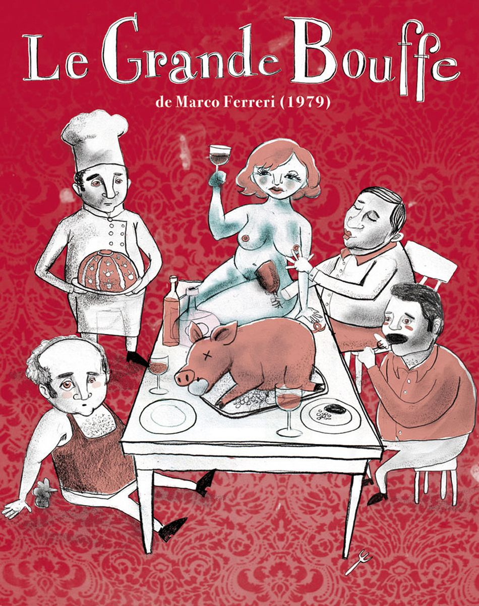

+++
author = "Meryem Ben yahia"
title = "A Feast of Gluttony, Desire and Death"
date = "2019-12-08"
description = "Philosophical Analysis of Marco Ferreri’s ‘La Grande Abbuffatta’"
categories = [
    "Philosophy", "Cinema", "Psychology"
]
tags = [
    "Philosophical Thought", "La Grande Abbuffatta", "Marco Ferreri", "Movie Review"
]

image = "2158.jpg"
+++
## **Introduction**

In 1973, Ferreri’s La Grande Bouffe was officially screened at the Cannes Film Festival where it 
stirred great outrage (Taillibert, 2002). Instantly after its projection, the film placed itself in a 
tradition of controversial movies that transcend from their initial shock value into debate and 
deliberation for decades to come.
Many questions come to mind when viewing Ferreri’s La Grande Bouffe; is it a jab at the 
debauchery of the bourgeoisie? Is there any deeper meaning to this spectacle of vomit and 
excrement? Or, is it a mere dark comedy with cheap overused gags? 
Without doubt, La Grande Bouffe is a confusing experience for the watcher.



Through this article, I investigate La Grande Bouffe philosophically. As I engage on the task, 
I will touch on three main sections: (I) the first is a reconstruction of movie’s plot along with 
its criticism, (II) the second and more substantial will be a discussion of the movie’s 
transgression, subversion and desecration of philosophical elements, (III) and finally the third 
section joins my conclusion on the movie and argumentation on its heightened philosophical 
significance over a sociological one. 

 

## **Section I: Reconstruction of the movie’s plot and criticism**

### **The Bourgeois Protagonists**

The movie begins with each protagonist in his own respective element:

 
- **Ugo**, restaurateur, owns “Le Biscuit a Soupe”. His strained relationship with his wife is 
demonstrated in their bickering over him wanting to take his knives, recipes and jarred 
goods on his trip.

- **Michel**, TV director, has programmed four weeks of televised shows and is willing to, in 
his own terms, “faire une bonne action” towards his daughter by giving her the keys to 
his apartment; in his dialogue with her, he insistently dismisses paternal authority.
 

 
- **Marcello**, the airline pilot, is perhaps the most mysterious of them. We do not get to see 
the condition of his household or his relationship dynamics. Instead, Marcello is only 
seen in his workplace.

-  **Philippe**, the judge, is babied by his nanny Nicole into a borderline incestuous 
relationship. He is fed, nagged and followed around by her. She performs a sexual act on 
him; which she qualifies as a continuity of her constant loving, adoring and motherly 
sacrifices for him, however Phillippe differs by saying to her: "You always violate me".

### **The Plot**

Despite their contrasting differences, the four characters have some commonalities. They all are 
keeping their escapade secret, and they all carry gifts into their mission. 
Ugo bears his culinary expertise, jars and knives, Michel brings cleaning utilities, Marcello imports cheese and packed 
goods, and finally Philippe offers the setting for the rest of the movie: a manor in the chicest 
district of Paris, in the street Boileau. 

After being welcomed into the manor by Hector, an elderly handyman, their first day is marked 
by a visit from a Chinese ambassador convoying purchasing the mansion, excessively grandiose 
meat and vegetable deliveries, and long preparations. Both Michel and Marcello interact with 
statuettes of women; Michel dusts then whips one with his glove inside the manor, while 
Marcello caresses perversely a statue in the garden. At dinner time, oysters are devoured at a 
frenetic pace by the four protagonists while they observe nude photography of young women. 
Ironically, Michel irritated and uncomfortable at the nudity points out: "We are not here to have a villainous orgy".

On the second day, Marcello expresses that he cannot only content himself with food: he needs 
women, and for one thing: having sex. Soon, a charming bubbly institutor Andrea invites herself 
along with her class to see the linden tree of Boileau, and then gets treated to delicious food. 
Immediately, she catches the Judge’s eye and she is invited for dinner with the four friends and 
three other eager sex workers. The dinner party is a debacle of food, nudity and sex, where 
Andrea reveals herself to be quite promiscuous. Michel lapidates a prostitute’s body with food 
while proclaiming repetitively: "The female body is a vanity". Philippe announces his 
engagement to Andrea. 

Eventually, the prostitutes forfeit one by one, expressing their disgust at the alimentary excesses 
of their hosts "Do things other than eat, eat, always eat". Michel starts to suffer 
from congestion gas pains, but still is pressured to keep eating by his friends. Philippe 
encourages him: "It is a question of will", while Ugo reminds him of their now evident 
suicide pact: “Eat again my little Michel, eat. If you don't eat, you won't pass away.". 

Andrea chooses to stay; stating so with an eerie expression on her face. In the following scene, 
she yells "I'm hungry!!" which prompts the four friends right back on track. The feast ensues, 
while their bodies start to break down; Michel is pained by violent flatulence, Ugo’s face is 
rosaceous and Marcello becomes impotent. 

In a moment of tension, Marcello breaks the fourth wall: “There is no fantasy in this story, they chose the crudest way to die”,
after which ultimately, with all the impetus of a crescendo, the toilets explode. 
Later on in bed with his friends, Ugo proclaims: “The smell of shit will never leave us”, to which Michel answers: "The Universal Flood". 

Still covered in fecal matter, Marcello tries to leave, only to be found dead behind the wheel of 
his beloved Bugatti. Michel follows and dies from an indigestion, Ugo gorges himself to death 
on his best creation. Philippe succumbs to his diabetes after eating breast shaped flans. Each of 
the four characters dies without dignity, nor the mercifulness of a proper burial. 
The final meat delivery ends up being useless, excessive and is plainly wasted: thrown by the 
butchers for the dogs to enjoy, while Andrea sorrowfully goes back to the manor. 

>**Tldr;** Four accomplished rich friends decide to die-- with the most basal of pleasurable ways: food.

### **Critique**

#### ***Critic 1: Jordan White***
According to a critic in DVD classic by Jordan White, a forum for movie’ analysis and critics, 
“La Grande Bouffe” is more than a simple comedy as it touches on passion, boredom, the midlife 
crisis of the forties and loneliness. Ferreri flips off the sanctimonious by paving the way for 
movies as iconic and as cult to be debated positively and negatively. White states that Marco 
Ferreri’s masterpiece makes us chuckle by its comedic pitch, by the actor’s investiture and 
dedication, but also by its ability to make us think (White, 2006).

#### ***Critic 2: Taillibert***
In Taillibert’s cinematic review, she theorizes that a serious diabetes crisis might have been a 
potential source for Ferreri’s cinematographic inspiration. However, she also finds that that the 
vices and weaknesses of the bourgeoisie had caught Ferreri’s attention and alternately led his wrath 
against the insolent opulence of capitalist societies, collective alienations, the Catholic 
Church, money and power; in which Ferreri’s cinematographic revolt was ultimately 
accomplished through food and sex, two elements that society places at the top ladder of pleasure.
Tallibert also discusses the newsroom’s reaction and inexhaustible surge of insults for the 
filmmaker. For some, it's the vulgarity of the film that is in cause, others reproached him the 
nihilistic foundations by putting forth humanistic values, while others hid behind the religious 
values of Christian morality. She concludes by stating that film’s like La Grande Bouffe are, 
after all, excellent tools to dissect the vices of modern society; quoting Michel Piccoli’s 
interview with Serge Toubiania on La Grande Bouffe in a special supplement of the Cahiers du 
cinema : « (…) comme si Marco nous ouvrait et nous montrait notre cancer » (Taillibert, 2002).

#### ***Critic 3: Christine Lahaie***
In the article « De Quelques Films Culinaires » by Christiane Lahaie, she states that “La Grande 
Bouffe” makes us reconcile with our nature as omnivores. Marco Ferrerri initiated a starter for a 
succession of movies in which consumption of food create the dramatic note like “Le Cuisinier, 
le voleur, Sa Femme et son Amant” by Peter Greenway. But none will ever attain the same level 
of abjection by linking food and death. However, she finds that the movie betrays misogynistic 
ideals through the character of Andrea as a helper of death and desire, and that is unaffected by 
an incessant gluttonous gurgitation of food. Lahaie sees La Grande Bouffe’s feasting as a 
catalyser of a deviant sexuality where food is a compensator for the repression of religion, fear of 
others and self-narcissism. (Lahaie, 2002)

## **Section II: Discussion: Transgression, Subversion and Desecration of Philosophical Elements**

In the movie, the four friends behaved in an opposite manner of what the 
ancient philosopher, Plato, commends. 
Plato's philosophy consists of the belief that the world is a reflection of a truer reality, and that in order to philosophize 
freely and attain knowledge, humans need to get rid of distraction and distortions. 
There are three main prohibited distractions that are encouraged in the movie: excess and gluttony, sex and art.

The characters subvert and transgress those elements: bodily pleasures, food and art are used as a distraction. 
They exceed the necessity and at some point; they affect the characters talents and 
diminishes their capacity to operate. 
An example of that is Ugo, an acclaimed the chef, who progressively gets worse at cooking or Michel who at first plays the piano smoothly and then 
gradually becomes worse by forgetting notes and so. 
Additionally, Plato considers art as speaking more to the heart than the mind and that it always is a copy of a copy. 
He also criticizes all types of corporeal pleasures if not attained through love as a stairway to observe beauty.
The mansion was full of statues and representations: Marcello gropes perversely the statue in the garden and also uses an object to excite the blonde prostitute. In a way, the narrative of the movie is a subversion of Plato’s philosophy that considers the body and its pleasures as impediments from intellectual freedoms.

Cynic philosophy sees the good life as achieved by following nature: pursuing natural instinct, 
manifested in simplicity, before social conventions and obligations. La Grande Bouffe desecrates 
that teaching by following natural instincts by using excesses birthed through modernism, 
conventions and obligations: the eccentricities and sophistication of the food, the decor and the 
prostitutes. As for Rousseau, he described meat-eating as one of the cruelties of the modern 
times, this idea can be seen as desecrated in the movie because the characters are overconsuming 
all kinds of meat and in the end the carcasses of animals are thrown to be eaten by animals: 
Rousseau considers meat-eating as “animals eating animals”. He prescribes eating normal food 
and vegetables and he claims that “everything that is beyond necessity is a source of evil”.
Schopenhauer claims that there is a fourth way to be liberated from the will which is death by 
suicide, but isn’t a solution to act on it because it is considered as a trick of the will since we are 
wishing for a better life and end of misery, and since we are no longer alive to “Enjoy the Show” 
unless death comes from slow starvation which is not considered a force of the will. 
The characters subvert that teaching by doing the opposite of what Schopenhauer claims: instead they 
eat themselves to death, which is not acceptable by him because they still “will to die” and 
haven’t lost their will as they would have in self-starvation from an extreme ascetic life. 
Schopenhauer also compares the will-of-life to music; Michel’s deteriorating musical capacities 
might metaphorically be a way of showing the mortification of the will.

Epicurean philosophy encourages a materialistic view of pain which sees it is not a thing to fear: 
major pain brings death and therefore deliverance from it, and generally encourages intellectual 
pleasures after the pleasures of needs fulfilled, and generally favors the natural and necessary 
pleasures over the non-natural and non-necessary ones. The latter is desecrated in the movie as 
the protagonists indulge in natural and the necessary pleasures and needs to an extreme beyond 
necessity and nature: gluttony and lechery. Lucretius conceptualizes sex and food as both 
fulfilling, but food will always surpass sex as it can be absorbed by our bodies and therefore is 
definitively more satisfying. This teaching is respected by the majority of the characters for the 
most part, except for a few transgressions made by Marcello and Andrea who equally seek food 
and sex and hold them to the same footing. It was Marcello’s idea to invite the prostitutes, 
because the satisfaction of food is not enough and fulfilling enough for him, he needs sex too. 
Ultimately, his breaking point is also directly related to him becoming impotent. 

## **Section III: General Conclusion**

To conclude, my verdict on La Grande Bouffe is that as preposterous and vulgar it might be: it 
is purposeful in, at the very least, reflecting the philosophical absurdity of human nature. 

The movie can be observed as a fable about desires. But, of no fable was it more rightfully said: 
it is unique in its linkage between death and desire. In its era, La Grande Bouffe dealt with a 
specific desire that almost no film director had ever dared to approach before; the desire of humans to 
die. The death drive, as originally coined by Sabrina Spielrein in 1912 and later expanded on in 
Freudian psychanalysis, is defined as the inclination of humans towards death and self-destruction (Spielrein, 1995). 

For Sigmund Freud, the death drive, Thanatos, is the antithesis of Eros, which is construed as the impulse
towards sex and survivalist instincts. Freud theorizes that all living beings have a desire or an instinct towards death (Cherry, 2019). 
From a philosophical standpoint, the concept of the death drive aligns with Schopenhauer’s view of life’s aim as death, 
as he considers existence itself as a continuum of dying and that completion is attained through it 
(Encyclopedia of Death and Dying, n.d.). 

Although in my opinion, **sex and death can work as reciprocals rather than opposites**. Both are 
uncomfortable and difficult to talk about. It is common to live in denial of death, just as it is to 
live in denial of our sexual desires. It takes ‘liberation’ to be open about sex, and ‘guts’ to accept 
death. Perhaps, to incite liberation by gutting the viewer is one of the purposes of Ferreri’s 
masterpiece. 
Sex and death are reciprocal reminders of our animalistic nature. 
Despite our efforts for distinction and sophistication or our inflated pride about human intellect; we remain animals regulated by the forces of nature. 
La Grande Bouffe is emblematic in admonishing the audience of that by celebrating of the body being reduced to its most animalistic functions: 
defecating, urinating, copulating, eating, gaging, regurgitating, inflating and dying (Celluloid 
Liberation Front, 2014). Over and over in the movie, the audience can pick up on those reminders. 
Marcello, the eccentric fashionable aviator, is hung in the freezer with beef carcasses, just like Michel. 
Ugo passes on the counter of the kitchen; his cadaver posed as the final piece-de-resistance of his cuisine. 
After being served dessert, the judge’s corpse is left amongst the meat in the garden. 

Their humanity is reduced to physiology, with their bodies typified as the flesh of animals; meat they gorged themselves upon. 

Marco Ferreri used provocation as a dynamic to represent a life without challenge and where all 
pleasures are attained; the life of the bourgeois. Our bourgeois protagonists lead a painstakingly 
monotone and boring life until they decide to end their lives: ironically, with too much appetite 
for life. 
Throughout the movie, it is hinted that our main four characters want to die until they blatantly admit to their suicide pact. 
They do not kill themselves pro-actively, but rather seek it passively as a result of their destructive overindulgence. 
The protagonists want to blissfully eat themselves to death. Ultimately, their pursuit of death is sought by what regulates life: food. 
Lack of food, just as excess of food, leads to suffering and death. 

Andrea’s character assembles both food and sex. She is the insatiable metaphorical ogress of La Grande Bouffe’s fable; the 
young woman opens herself to a universe she didn’t think she was able to make hers, and thus 
liberates herself to unleash her insatiable appetite for lechery and gluttony. Andrea also becomes 
as sort of anti-mother; she offers the maternal tenderness by being kind and infantilizing the 
names of the four protagonists, but she is not a mother that births, rather than that she is a mother 
that guides them to death. Thus, the symbolization of the drive of death, sex and food is taken to 
its extreme to serve us, the audience; **a feast of gluttony, desire and sex**.

The heightened philosophical importance of the movie over its sociological one is evident in that 
symbolization. The movie has some sociological facets: it openly scandalizes a consumerist 
elitist bourgeois class, perhaps on the basis of received ideas and stereotypes on the bourgeoisie 
in its time. Yet observing it only as primarily sociological limits its range: it targets only a 
stereotyped bourgeois class and their pursuit of death can be just passed as an extravagance and 
indulgence. On the other hand, accosting La Grande Bouffe as a philosophical movie is much 
more interesting; it gains much more meaning as it can relate, more broadly, to the philosophy of 
human nature, the meaninglessness of life, the pursuit of pleasure, absurdism and of most 
relevantly to our class: food. 

Finally, it is important to point out La Grande Bouffe has pushed audiences and critics to search 
for meaning in its meaninglessness as if to make an absurdist point; a majority of secondary 
characters and events seem to have no plot relevancy to the story or the character development, 
yet these characters and those events simply exist. 

## **Section IV: Bibliography**
Celluloid Liberation Front. (2014, March 25). Consumerist Ultimate Indigestion: La Grande 
Bouffe's Deadly Physiological Pleasures. 
Retrieved from https://brightlightsfilm.com/consumerist-ultimate-indigestion-la-grande-bouffes-deadly-physiological-pleasures/#.Xd73t-j7RPY.

Cherry, K. (2019, June 27). How Life and Death Instincts Are Opposing Urges. 
Retrieved from https://www.verywellmind.com/life-and-death-instincts-2795847.

Encyclopedia of Death and Dying. (n.d.). Schopenhauer, Arthur. 
Retrieved from http://www.deathreference.com/Py-Se/Schopenhauer-Arthur.html.

Lahaie, C. (2002). De quelques films culinaires : entre Éros et Thanatos. Québec français (126),
55–57. URI: https://id.erudit.org/iderudit/55841ac .

Spielrein, S. (1995). "Destruction as cause of becoming" by Sabina Spielrein, M.D. 
Psychoanalysis & Contemporary Thought, 18(1), 85–118.

Taillibert, C. (2002). La grande bouffe (Marco Ferreri 1973). Cinemaction; Filméditions; Corlet, 
1-6. HAL Id : halshs-02190551, version 1.

White, J. (2006, February 9). Critique De Film - La Grande bouffe. 
Retrieved from http://www.dvdclassik.com/critique/la-grande-bouffe-ferreri?fbclid=IwAR3vxrBrfaJFAxSInrh5LI7MPgynkiKT4tKlWTV6_HFRbPx3NGyqTSSp1oM




