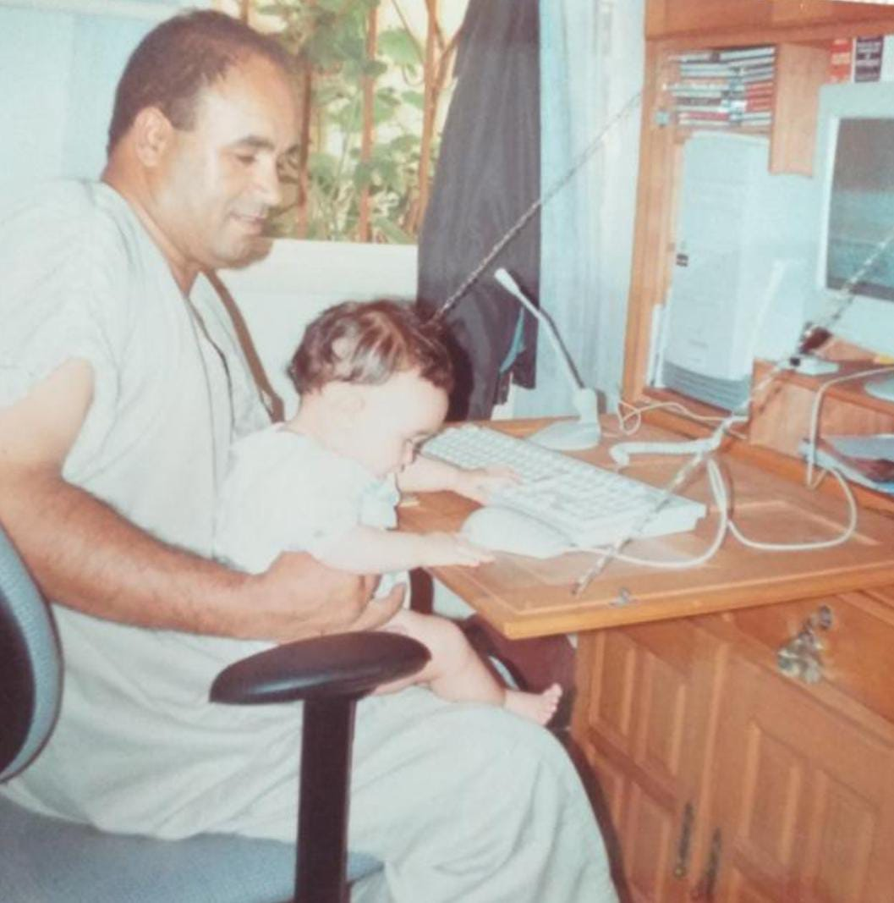

+++
author = "Meryem Ben yahia"
title = "Navigating through Grief"
date = "2022-02-11"
description = ""
categories = [
    "Thoughts",
]
tags = [
]

image = "jun-S3WKb9TmRxo-unsplash.jpg"
+++

My father passed away. 

And grief became a fever dream where I got to relive all my lost innocence. From shutting the door of the fridge to the smallest possible crease to see when the light would turn off. To the childish game of only stepping in the lithe figure of his shadow… To hearing the clinks of his keys before the door would even open. 

I was a tower, a solid structure, built on the crumbling ground. I am no longer myself. I rarely ever say what I really think I just choose the most fun interactions. I say things I don’t mean, and I always chase distractions. Inconsequently, going from one long string of bad decisions to another.

Maybe dad would’ve said that when it rains, you set up your barrels and when it winds, you start your turbines. My dad would’ve said to be my own boss.

But his death was just insurmountable. I suffered through it. From the moment he fell into a coma, to the last time I hugged him, a corpse. 

Grief is seeing a recipe for mashed potatoes and crying because the last time that I made them for him, they weren’t just like he liked them.

Grief is guilt and loss and pain and missing him like a little kid.

Grief feels like being a little girl again and anxiously waiting for him to come back from work so that he could pick me up in his arms.

Grief is all the times he was proud of me and disappointed by me into one unbearable feeling.

Grief is me being irrational, delusional, and heartbroken more than I ever was.

And grief is desolation because there is no way of seeing you or talking to you and it feels like you only exist behind me and I’m only getting further ahead.

Grief is not knowing if I miss you more than I love you or if I love you more than I miss you. 

Mon père est décédé.

Et le deuil est devenu un rêve fiévreux où j’ai pu revivre toute mon innocence perdue. Comme ce moment où je refermais la porte du frigo tout doucement, guettant le plus petit interstice pour voir quand la lumière s’éteignait. Comme ce jeu d’enfant où je ne posais mes pas que dans la silhouette souple de son ombre… Ou encore ce moment où j’entendais le tintement de ses clés bien avant que la porte ne s’ouvre. 

J’étais une tour, une structure solide, bâtie sur un sol qui s’effrite. Je ne suis plus moi-même. Je dis rarement ce que je pense vraiment, je choisis simplement les interactions les plus légères. Je dis des choses que je ne pense pas, et je poursuis sans cesse des distractions. Je passe d’une mauvaise décision à une autre.

Papa aurait peut-être dit qu’il faut tendre des tonneaux quand il pleut et dresser des éoliennes quand il vente. Il aurait sans doute ajouté que je devais être ma propre patronne.

Mais sa mort est infranchissable. Je l’ai endurée. Du moment où il est tombé dans le coma, jusqu’à la dernière fois où je l’ai pris dans mes bras, un cadavre.

Le deuil, c’est pleurer devant une purée de pommes de terre parce que la dernière fois que je lui en ai fait, ce n’était pas comme il les aimait.

Le deuil, c’est la culpabilité, la perte, la douleur qui me réduit à l’état d’une enfant.

Le deuil, c’est redevenir une petite fille qui attend impatiemment que son père rentre du travail, juste pour qu’il la prenne dans ses bras.

Le deuil, c’est toutes les fois où il était fier de moi et toutes celles où je l’ai déçu, en une seule émotion insoutenable.

Le deuil, c’est être irrationnelle, déconnectée, brisée d’une manière que je n’avais jamais connue auparavant.

Et le deuil, c’est la désolation. C’est l’absence, irrévocable, de toute possibilité de te voir ou de te parler. CComme si tu n’existais que derrière moi, alors que j’étais forcée de m’éloigner de plus en plus par les lois de l’univers.

Le deuil, c’est ne pas savoir si tu me manques plus que je t’aime ou si je t’aime plus que tu me manques.




